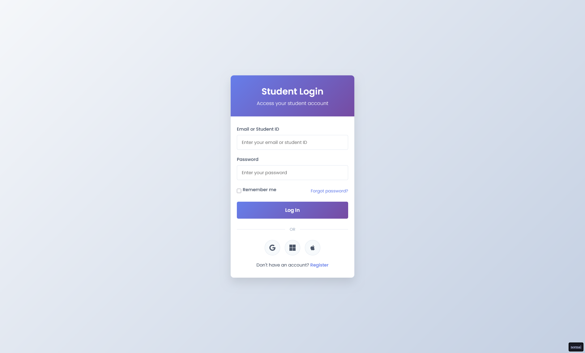
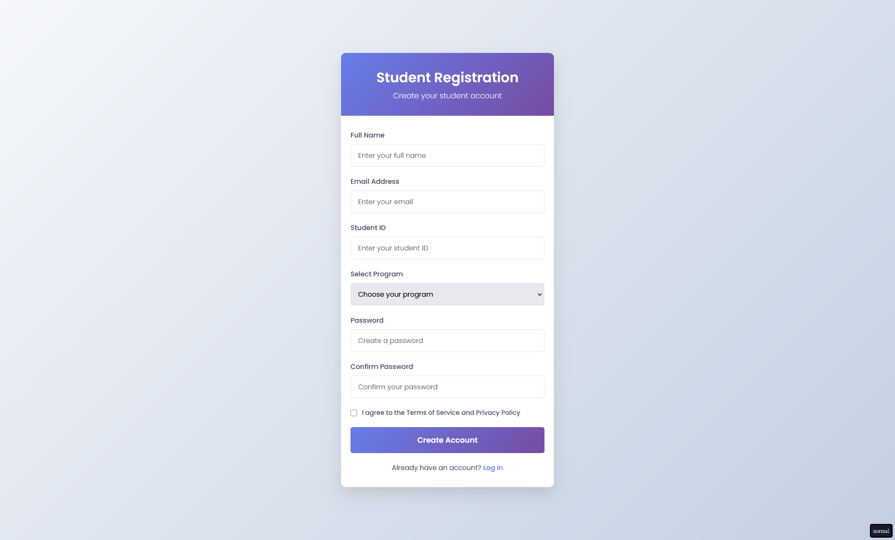
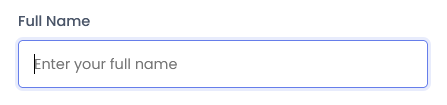
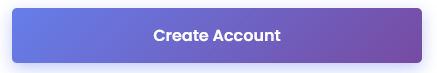
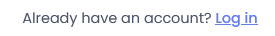

# Использование форм

## Цель:

Разработать функциональную форму

### Логин

_Является станадртной страницей, которая будет открываться (`index.html`)_

<p align="center">
    
</p>

### Регистрация

_Можно перейти с логина через якорь_

<p align="center">
    
</p>

### Резет CSS

Подключите [данный](https://gist.githubusercontent.com/ktkv419/c8840dfcbcff24248c20f4199108b28e/raw/eec499022cca5ed984d91d2a2c2736d2aef8ed6d/reset.css) CSS файл перед подключением вашего для нормализации правил CSS

_Создайте файл `reset.css` и подключите его перед своим файлом стилей_

### Шрифты

- Poppins

_Вот бы заблокировать самую главную [библиотеку со шрифтами](https://fonts.google.com)..._

```html
<link rel="preconnect" href="https://fonts.googleapis.com">
<link rel="preconnect" href="https://fonts.gstatic.com" crossorigin>
<link href="https://fonts.googleapis.com/css2?family=Poppins:ital,wght@0,100;0,200;0,300;0,400;0,500;0,600;0,700;0,800;0,900;1,100;1,200;1,300;1,400;1,500;1,600;1,700;1,800;1,900&display=swap" rel="stylesheet">
```

### Цвета

#### Акцентные

- #667eea (он же rgba(102, 126, 234, 0.15))
- #764ba2

#### Задники

- #f5f7fa
- #c3cfe2
- #4a5568

### Функционал

- Формы должны отправлять POST запрос с полями

Логин:
- email
- password
- remember

_На адрес `/api/login`_

Регистрация:
- fullname
- email
- student-id
- program
- password
- terms

_На адрес `/api/register`_

Внутри дропдаун меню должны быть пункты:

- Computer Science
- Engineering
- Business
- Arts & Humanities
- Science

### Псевдосостояния

#### Ввод 

_При нажатии на форму появляется обводка_

<p align="center">
    
</p>

#### Кнопка

_При наведении поднимается чутка вверх (`transform: translate()`) и появляется тень_

<p align="center">
    
</p>

#### Ссылка

_При наведении появляется подчеркивание_

<p align="center">
    
</p>

### Медиа

Для иконок используются `svg` файлы обычно через библиотеки, чтобы не усложнять задачу - иконки представлены кодом

#### Google

```html
<svg stroke="currentColor" fill="currentColor" stroke-width="0" viewBox="0 0 488 512" height="200px" width="200px" xmlns="http://www.w3.org/2000/svg"><path d="M488 261.8C488 403.3 391.1 504 248 504 110.8 504 0 393.2 0 256S110.8 8 248 8c66.8 0 123 24.5 166.3 64.9l-67.5 64.9C258.5 52.6 94.3 116.6 94.3 256c0 86.5 69.1 156.6 153.7 156.6 98.2 0 135-70.4 140.8-106.9H248v-85.3h236.1c2.3 12.7 3.9 24.9 3.9 41.4z"></path></svg>
```

#### Microsoft

_Иконка отличается, используйте эту_

```html
<svg stroke="currentColor" fill="currentColor" stroke-width="0" viewBox="0 0 448 512" height="200px" width="200px" xmlns="http://www.w3.org/2000/svg"><path d="M0 93.7l183.6-25.3v177.4H0V93.7zm0 324.6l183.6 25.3V268.4H0v149.9zm203.8 28L448 480V268.4H203.8v177.9zm0-380.6v180.1H448V32L203.8 65.7z"></path></svg>
```

#### Apple

```html
<svg stroke="currentColor" fill="currentColor" stroke-width="0" viewBox="0 0 384 512" height="200px" width="200px" xmlns="http://www.w3.org/2000/svg"><path d="M318.7 268.7c-.2-36.7 16.4-64.4 50-84.8-18.8-26.9-47.2-41.7-84.7-44.6-35.5-2.8-74.3 20.7-88.5 20.7-15 0-49.4-19.7-76.4-19.7C63.3 141.2 4 184.8 4 273.5q0 39.3 14.4 81.2c12.8 36.7 59 126.7 107.2 125.2 25.2-.6 43-17.9 75.8-17.9 31.8 0 48.3 17.9 76.4 17.9 48.6-.7 90.4-82.5 102.6-119.3-65.2-30.7-61.7-90-61.7-91.9zm-56.6-164.2c27.3-32.4 24.8-61.9 24-72.5-24.1 1.4-52 16.4-67.9 34.9-17.5 19.8-27.8 44.3-25.6 71.9 26.1 2 49.9-11.4 69.5-34.3z"></path></svg>
```

# Теория

_Все блоки кода это просто примеры, сравнивайте с референсом-картинкой_

## Базовая структура формы

```html
<form action="/api/register" method="post">
  <!-- поля формы -->
  <button type="submit">Отправить</button>
</form>
```

### Атрибуты `<form>`

| Атрибут | Описание | Пример |
|---|---|---|
| `action` | Куда отправляются данные / куда перейти | `action="login.html"` |
| `method` | Метод отправки: `get` или `post` | `method="get"` |
| `novalidate` | Отключить браузерную валидацию | `novalidate` |

---

## Переход между страницами

### Ссылка `<a href>`
Простая навигация, не связанная с отправкой формы:

```html
<!-- На странице входа (login.html) -->
<p>Нет аккаунта? <a href="register.html">Зарегистрироваться</a></p>

<!-- На странице регистрации (register.html) -->
<p>Уже есть аккаунт? <a href="login.html">Войти</a></p>
```


### Структура файлов

```
project/
├── login.html       ← страница входа
├── register.html    ← страница регистрации
└── style.css
```

---

## Элементы форм

### `<input>` — текстовые поля

```html
<!-- Подпись к полю — всегда через label -->
<label for="email">Email</label>
<input type="email" id="email" name="email" placeholder="example@mail.com">
```

> Атрибут `for` у `<label>` должен совпадать с `id` у `<input>` — это связывает их: клик по подписи фокусирует поле.

#### Типы `<input>` для форм входа/регистрации

| Тип | Использование | Особенность |
|---|---|---|
| `type="text"` | Имя, логин | Обычное текстовое поле |
| `type="email"` | Email | Браузер проверяет формат @ |
| `type="password"` | Пароль | Скрывает вводимые символы |

```html
<!-- Поле имени -->
<label for="name">Имя</label>
<input type="text" id="name" name="name" placeholder="Иван">

<!-- Поле email -->
<label for="email">Email</label>
<input type="email" id="email" name="email" placeholder="ivan@mail.ru">

<!-- Поле пароля -->
<label for="password">Пароль</label>
<input type="password" id="password" name="password" placeholder="Минимум 8 символов">
```

#### Полезные атрибуты `<input>`

| Атрибут | Описание |
|---|---|
| `placeholder` | Подсказка внутри поля (исчезает при вводе) |
| `name` | Имя поля при отправке формы |
| `id` | Связка с `<label>` |
| `disabled` | Поле отключено |
| `required` | Поле обязательно (браузерная проверка) |
| `autocomplete="off"` | Отключить автозаполнение |

---

### `<input type="checkbox">` — чекбокс

```html
<label>
  <input type="checkbox" name="agree" value="yes">
  Я принимаю условия использования
</label>
```

#### Чекбокс по умолчанию отмечен

```html
<input type="checkbox" name="remember" checked>
```

#### Группа чекбоксов

```html
<fieldset>
  <legend>Интересы</legend>
  <label><input type="checkbox" name="interest" value="design"> Дизайн</label>
  <label><input type="checkbox" name="interest" value="dev"> Разработка</label>
  <label><input type="checkbox" name="interest" value="marketing"> Маркетинг</label>
</fieldset>
```

---

### `<select>` и `<option>` — выпадающий список

```html
<label for="role">Кто вы?</label>
<select id="role" name="role">
  <option value="">— Выберите роль —</option>
  <option value="student">Студент</option>
  <option value="teacher">Преподаватель</option>
  <option value="other">Другое</option>
</select>
```

> Первый `<option>` с пустым `value=""` — это заглушка-подсказка. Хорошая практика — всегда добавлять его.

#### Атрибуты `<select>`

| Атрибут | Описание |
|---|---|
| `multiple` | Можно выбрать несколько вариантов |
| `size="3"` | Показывает 3 варианта без раскрытия |
| `disabled` | Список отключён |

#### Группировка вариантов — `<optgroup>`

```html
<select name="city">
  <optgroup label="Россия">
    <option value="msk">Москва</option>
    <option value="spb">Санкт-Петербург</option>
  </optgroup>
  <optgroup label="Беларусь">
    <option value="mnk">Минск</option>
  </optgroup>
</select>
```

---

### `<fieldset>` и `<legend>` — группировка полей

Используется для логической группировки связанных полей:

```html
<fieldset>
  <legend>Личные данные</legend>

  <label for="name">Имя</label>
  <input type="text" id="name" name="name">

  <label for="email">Email</label>
  <input type="email" id="email" name="email">
</fieldset>

<fieldset>
  <legend>Безопасность</legend>

  <label for="password">Пароль</label>
  <input type="password" id="password" name="password">
</fieldset>
```

> `<fieldset>` по умолчанию рисует рамку вокруг группы. Чаще всего её сбрасывают стилями и используют только семантику.

```css
/* Сброс дефолтных стилей fieldset */
fieldset {
  border: none;
  padding: 0;
  margin: 0;
}
```

---

### Кнопки

```html
<!-- Отправить форму -->
<button type="submit">Зарегистрироваться</button>

<!-- Сбросить форму -->
<button type="reset">Очистить</button>

<!-- Просто кнопка (не отправляет форму) -->
<button type="button">Отмена</button>
```

---

## CSS-стилизация форм

### Стилизация `<input>`

```css
/* Обычное состояние */
input[type="text"],
input[type="email"],
input[type="password"] {
  width: 100%;
  padding: 10px 14px;
  border: 1px solid #ccc;
  border-radius: 6px;
  background: #fff;
  color: #333;
}

/* В фокусе */
input:focus {
  border-color: #3498db;
  outline: none;
  box-shadow: 0 0 0 3px rgba(52, 152, 219, 0.2);
}

/* Отключено */
input:disabled {
  background: #f0f0f0;
  color: #aaa;
  cursor: not-allowed;
}

/* Placeholder */
input::placeholder {
  color: #aaa;
  font-style: italic;
}
```

### Псевдоклассы для форм — сводная таблица

| Псевдокласс | Когда работает |
|---|---|
| `:focus` | Поле в фокусе (клик или Tab) |
| `:disabled` | Атрибут `disabled` на элементе |
| `:enabled` | Элемент активен (по умолчанию) |
| `:checked` | Чекбокс/радио отмечен |
| `:placeholder-shown` | В поле виден placeholder (пусто) |
| `:not(:placeholder-shown)` | Пользователь начал вводить |
| `:hover` | Курсор над элементом |
| `:active` | В момент нажатия |

> Документация:
> - [MDN — `<form>`](https://developer.mozilla.org/ru/docs/Web/HTML/Element/form)
> - [MDN — `<input>`](https://developer.mozilla.org/ru/docs/Web/HTML/Element/input)
> - [MDN — `<select>`](https://developer.mozilla.org/ru/docs/Web/HTML/Element/select)

# Как сдавать

- Создайте форк репозитория в вашей организации с названием-этого-репозитория-вашафамилия
- Используя ветку wip сделайте задание
- Зафиксируйте изменения в вашем репозитории
- Когда документ будет готов - создайте пул реквест из ветки wip (вашей) на ветку main (тоже вашу) и укажите меня (ktkv419) как reviewer

Не мержите сами коммит, это сделаю я после проверки задания
